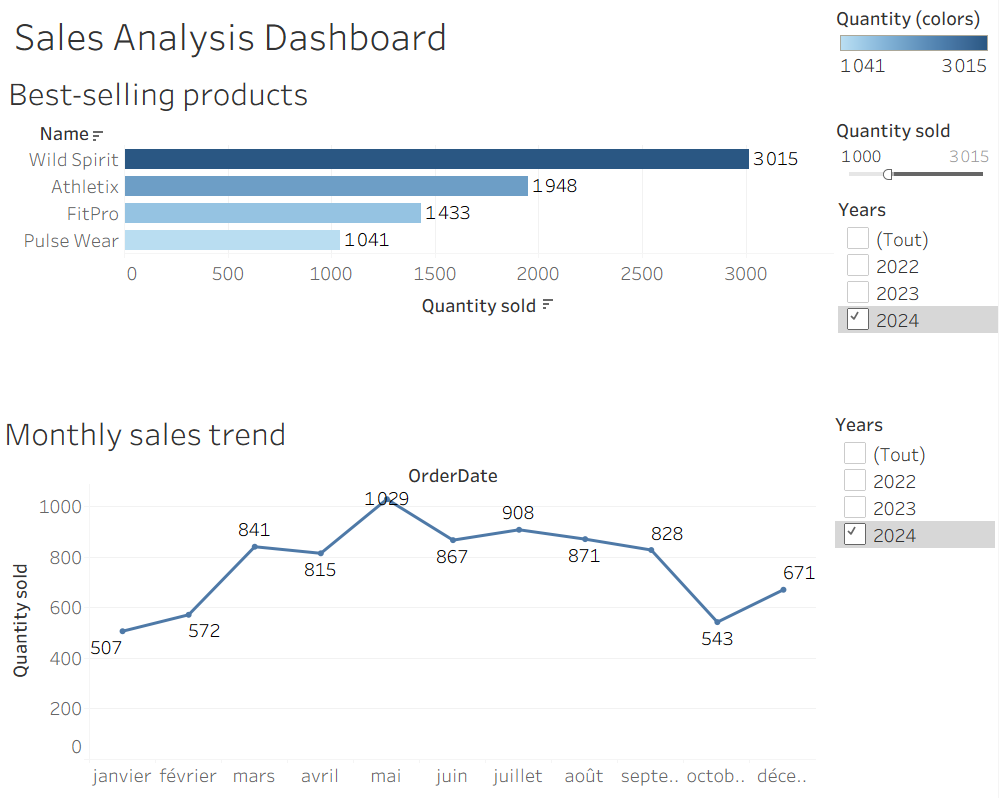

# Sales Analysis Dashboard 📊 

An interactive sales dashboard built with Tableau analyzing trends and
top products.

---

## 📸 Preview

---

## Key Insights
- Monthly sales evolution and trends
- 10 best-selling products

---

## Built with
- Tableau Desktop

---

## Dataset
- Source : Internal sales data
- Format : CSV
- Content : Sales transactions including dates, products, regions and revenue

---

## Project structure

sales-performance-dashboard/

├── sales-analysis-dashboard.twbx  # Tableau packaged workbook

├── sales.csv                      # Raw data

├── dashboard-screenshot.png       # Dashboard preview

└── README.md                      # Project documentation

---

## Author
[LinkedIn](www.linkedin.com/in/marie-cheynour-mchangama) | [GitHub](https://github.com/mcheynour)
